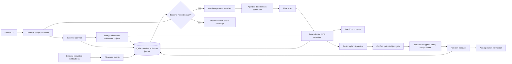

# Blast Radius 开发计划

> 版本 0.9；核验日期：2026-09-29（Asia/Singapore）。0.2 已获批准，阶段 1 `In progress`；阶段 2–4 `Todo`。实现状态和实测证据在第 10 节更新，不以文档设计代替测试结果。

## 1. 当前目标、场景与承诺

定位：**Local change review and conflict-aware recovery for coding-agent sessions.** 用户先指定一个工作目录和少量仓库外路径，再通过 `blast run --root . -- <command> [args...]` 启动命令。结束后查看已覆盖范围的首尾差异、证据等级、备份完整性和恢复冲突，按预览结果选择文件恢复到会话前状态。第一轮只用确定性模拟命令验证，不依赖 Agent 登录或 API。

首版承诺：**对事先选定、成功建立基线且受支持的本地文件范围，记录会话前后的状态差异，提供带预览、冲突检测和恢复日志的文件恢复。** 仓库既有未提交和未跟踪内容属于基线，恢复只涉及用户选中的工作区文件；被包装命令若改动 HEAD、index、stash、提交或其他 `.git` 元数据，Blast 不恢复它们，也不调用 Git 自动回滚。`.git` 元数据默认排除并明确显示。

非目标：全机副作用、完整工具/文件操作史、敏感读取审计、全部 Agent 归因、撤销任意 shell 命令、阻止泄露、整机事务、沙箱或 Git 替代、对同用户恶意进程的防篡改。首版只有通用 CLI 包装；Claude 专用适配器是阶段 3；Codex/Gemini 专用适配器未承诺。OpenShell 不作为依赖。注册表、包管理器、进程和网络即使后续能观察，也先报告，不自动做补偿动作。

## 2. 本机只读检查

| 检查项 | 结果（2026-09-29） | 设计影响 |
|---|---|---|
| 工作目录 | 阶段 0 检查时 `E:\Projects\Kaspi\Blast_Radius` 有 0 个条目；`git status` 报非 Git 仓库 | 不初始化或改动真实 Git；阶段 1 在临时目录造测试仓库。阶段 0 创建了两份 Markdown。 |
| Windows | `Get-ComputerInfo`：`OsName` 为 Windows 11 家庭版中文版，build 26200，x64；`WindowsProductName` 另显示 Windows 10 Home China（注册表字段不一致） | 以 OS 名称/build 记录测试环境，不由产品名字符串推断功能。 |
| Shell | PowerShell 7.6.5；`powershell.exe` 和 `bash.exe` 可找到；后者是否为 Git Bash 未核验 | 原生 `.exe`、`.cmd` 与交互终端分别测试。找到 `bash.exe` 不等于 Claude 使用它。 |
| .NET / Git | SDK 10.0.303、runtime 10.0.12、Git 2.45.1.windows.1 | 采用 .NET 10；后续 pin SDK 与 NuGet 依赖。 |
| Agent 启动器 | Claude Code 2.1.222、Codex CLI 0.158.0-alpha.2.1、Gemini CLI 0.6.1 的 `--version` 成功 | 只证明启动器存在；未登录、未运行会话、未验证 hooks/沙箱行为。 |
| 目标卷 | E: 为健康的本地固定 NTFS 卷 | 阶段 1 先在同卷临时目录做文件系统测试；其他卷/UNC/WSL 不推定支持。 |

## 3. 影响设计的事实核验

表中“已核实”指 2026-09-29 阅读的官方文档或本机只读命令；不等于功能已由本项目实测。官方网页可能先于本机 Agent 版本；集成前重新核对对应版本。

| 问题 | 已核实结论 | 来源与日期 | 对设计的影响 | 待实测内容 |
|---|---|---|---|---|
| Claude checkpoint / rewind | 文档称每个新 turn 提示建立检查点，追踪其文件编辑工具；Bash 命令改动不追踪，通常不恢复其他子 Agent 的编辑，外部改动也不作为通用覆盖。某些前台 fork skill 是例外。 | [Claude checkpointing](https://code.claude.com/docs/en/checkpointing)，2026-09-29 | 独立的会话前基线覆盖明确范围；不宣传比 Claude 精确的 Agent 归因。 | 本机 2.1.222 的 rewind、后台与子 Agent 行为。 |
| Claude hooks 与 Windows shell | 文档列出 `PreToolUse`、`PostToolUse`、`PostToolUseFailure`、`SubagentStart/Stop`、`SessionEnd`；匹配的 hooks 并行运行，工具事件可出现在子 Agent 中并携带 `agent_id`。Windows 还有 `PowerShell` 工具，不能只匹配 `Bash`。hook 输入是事件 JSON，不是 shell 内每次文件操作。 | [Claude hooks](https://code.claude.com/docs/en/hooks)，2026-09-29 | 检查点需按工具调用 ID/Agent ID 关联，处理并发和缺失结束事件；匹配 Bash 与 PowerShell；最终文件状态仍靠扫描。 | 本机实测 JSON、顺序、后台调用、Windows shell 选择、会话退出行为。 |
| Hook 失败、超时和接入 | 文档显示普通 hook 非 2 退出、无法启动和 `PreToolUse` 命令 hook 超时通常不阻止调用；`PostToolUse` 已在操作后。hooks 可来自设置或插件且合并，文档展示临时 `--settings`，但本机 2.1.222 对会话级配置/插件能否安全接入未验证。 | [Claude hooks](https://code.claude.com/docs/en/hooks)，2026-09-29 | 先做通用包装；以后显式、可撤销地接入，绝不自动覆盖用户设置或称 hook 为安全沙箱。严格阻断须逐版本实测失败路径。 | 本机 CLI `--settings` 与插件、已有 hooks 共存、失败码和超时。 |
| Claude 沙箱 | 官方沙箱页称其 Bash 沙箱支持 macOS/Linux/WSL2，原生 Windows 不支持；这是 Claude 的该项功能说明，不能套用到 Codex。 | [Claude sandboxing](https://code.claude.com/docs/en/sandboxing)，2026-09-29 | Blast 不要求关闭任何 Agent 原有隔离/审批；包装兼容性单独测。 | 本机 Claude 启动与沙箱配置，不读取私有设置。 |
| Codex Windows | 官方 Windows 文档说明桌面、CLI、IDE 可以原生运行；原生 Windows 的 agent 模式有 elevated/unelevated 两种沙箱，WSL2 使用另一执行环境。不能说“Codex 原生 Windows 没有沙箱”。 | [Codex Windows sandbox](https://learn.chatgpt.com/docs/windows/windows-sandbox)、[OpenAI 技术说明](https://openai.com/index/building-codex-windows-sandbox/)，2026-09-29 | 首版只包装通用进程，不覆盖/绕过 Codex 的权限；桌面应用、CLI、IDE 和 WSL 分开记录兼容性。 | 本机 Codex CLI 与桌面会话各自的包装/沙箱行为。 |
| OpenShell | 官方 support matrix 区分 dev、pre-release、stable；Windows WSL2 + Docker Desktop 主机为 Experimental；运行时页把 Windows MXC 标为 Coming soon。文档同时有日志/导出导航，不能断言其“完全没有审计”。 | [OpenShell support matrix](https://docs.nvidia.com/openshell/latest/about/support-matrix)、[runtimes](https://docs.nvidia.com/openshell/latest/how-it-works/sandboxes/runtimes)、[上游仓库](https://github.com/NVIDIA/OpenShell)，2026-09-29 | 与它的隔离能力独立；本项目聚焦显式保护范围、原内容和冲突恢复。不固定上游未来版本或 RFC 状态。 | 有需要时才做特定发布版比较；不作为阶段 1 依赖。 |
| Windows USN | NTFS USN 记文件/目录变化理由，记录可清理或合并，不能逆转内容，也不提供可靠进程归因/文件读取审计。 | [Change Journal Records](https://learn.microsoft.com/en-us/windows/win32/fileio/change-journal-records)，2026-09-29 | USN 后置；不能取代预运行内容快照。 | 普通用户读取权限、丢口、日志切换。 |
| 目录通知 | `ReadDirectoryChangesW` 报目录内变化而非目录自身；溢出会丢明细并需重枚举。`FILE_NOTIFY_INFORMATION` 含动作与文件名（可有旧/新重命名名），无 PID 和旧内容。`FileSystemWatcher` 会因缓冲区溢出丢事件。 | [ReadDirectoryChangesW](https://learn.microsoft.com/en-us/windows/win32/api/winbase/nf-winbase-readdirectorychangesw)、[FILE_NOTIFY_INFORMATION](https://learn.microsoft.com/en-us/windows/win32/api/winnt/ns-winnt-file_notify_information)、[FileSystemWatcher](https://learn.microsoft.com/en-us/dotnet/api/system.io.filesystemwatcher?view=net-10.0)，2026-09-29 | 事件只作辅助线索；基线与结束扫描决定可验证的状态差异。溢出标记历史不完整，补扫不补造历史。 | 本机溢出、重命名配对、根目录被移动、子目录批量移动。 |
| VSS | 官方资料描述 VSS 请求方/写入方和快照语义，备份/恢复特定操作可能要求 `SE_BACKUP_NAME`、`SE_RESTORE_NAME` 等权限；未发现足以支持“仅 Pro 能用”的官方依据。 | [VSS portal](https://learn.microsoft.com/en-us/windows/win32/vss/volume-shadow-copy-service-portal)、[权限与文件系统](https://learn.microsoft.com/en-us/windows/win32/vss/working-with-file-system-and-security-features)，2026-09-29 | 不把 VSS 作为首版普通用户前提，不申请管理员权限；版本、SKU、提供程序及实际权限须另测。 | Home SKU 上由普通用户创建/读取快照的实测。 |
| .NET 生命周期 | .NET 10 为 LTS，官方页在核验日列 Active，支持至 2028-11-14；本机装有 10.0.303 SDK。 | [.NET support policy](https://dotnet.microsoft.com/en-us/platform/support/policy)、本机 `dotnet --info`，2026-09-29 | 默认 C#/.NET 10；发布时重验补丁版本。 | NuGet/打包可用性及 Windows 运行时兼容。 |
| Windows 恢复原语 | `CreateFileW` 的共享模式可排斥冲突打开；`CREATE_NEW` 仅在不存在时创建；长路径需明确处理。它们是构造安全流程的原语，不自动保证整个目录快照或多文件原子性。 | [CreateFileW](https://learn.microsoft.com/en-us/windows/win32/api/fileapi/nf-fileapi-createfilew)、[ReplaceFileW](https://learn.microsoft.com/en-us/windows/win32/api/winbase/nf-winbase-replacefilew)、[GetFinalPathNameByHandleW](https://learn.microsoft.com/en-us/windows/win32/api/fileapi/nf-fileapi-getfinalpathnamebyhandlew)，2026-09-29 | 实现前做句柄/路径竞态实验；无法排除写入和重定向时拒绝。 | 共享模式、替换/删除、父路径交换及崩溃注入的真实 NTFS 测试。 |

## 4. 默认技术栈和架构

- C# / .NET 10 单一 CLI 程序，少量明确的 Core、Storage、Windows、CLI/Reporting 模块；不为模块创建空项目或通用插件框架。
- SQLite 存结构化状态、规则版本、覆盖信息和逐项持久恢复日志；内容寻址对象库存经过验证的加密文件内容，包括基线、后续检查点和恢复前安全副本。文件正文不进入数据库、日志或报告。加密流直接写入加密临时对象，校验并持久化后才发布对象引用。最小恢复日志、对象/安全副本完整性和进程中断处理属于阶段 1 的 apply 前置条件；详细提交顺序见第 5 节。
- `FileSystemWatcher` 仅作阶段 2 的辅助观察；阶段 1 即可由完整基线 + 结束扫描形成可靠的**最终状态差异**。没有 watcher 时报告 `event_history: unavailable`，不能显示“无事件”。
- 本地 JSON/text 报告先行；HTML、发布物后置。所有报告中的路径/内容摘要和错误须避免泄密，HTML 转义，终端控制字符转义。默认不录制终端内容、不上传。

状态库必须在所有保护根外；根包含状态库、相互重叠的活跃保护范围、或根被替换时拒绝启动/恢复。默认不扫描系统盘或整个用户目录。外部文件/目录必须显式列出，按根和相对路径存储，不靠字符串 `startsWith` 判断包含关系。阶段 1 只以同卷本地 NTFS 为支持目标；两个本地 NTFS 卷上的仓库与显式外部文件属于阶段 2 的独立验收，未通过前拒绝跨卷运行/恢复。中央加密对象库与**目标卷内**明文恢复暂存承担不同责任，不能把跨卷复制当作原子替换。

## 5. 数据结构、状态机与保留

所有持久 JSON/SQLite 实体带 `schema_version`；不认识的未来版本只读拒绝写。核心实体：

| 实体 | 必需字段与关系 |
|---|---|
| `Session` | `session_id`、开始/结束时间、根 ID、命令身份（可选脱敏 argv）、`child_exit_code`（未启动则 null）、`blast_status`、生命周期状态、覆盖汇总、规则版本。关联 scopes、manifests、events、checkpoints、restore plans。 |
| `ProtectionScope` | `scope_id`、根的规范路径/卷 ID/目录身份、类型（workspace/external file/external dir）、固定纳入规则与明确排除规则及其版本、用户确认记录、配额、required/observe-only、覆盖状态及失败原因。 |
| `FileState` / `Manifest` | `(checkpoint_id, scope_id, relative_path)`，`presence: Present | Absent | Unknown`、类型、长度、内容哈希/对象引用（仅 Present 需要）、文件 ID、卷 ID、链接数、必要属性/ACL 策略、读取稳定性和失败码。零字节文件仍为 Present；读取失败、权限不足、扫描不完整为 Unknown；目录节点用于父路径验证。 |
| `SnapshotObject` | 密文对象哈希、明文内容校验信息、长度、加密格式/密钥包装版本、完整性状态、引用计数/可重建引用关系、持久化状态；明文秘密不写数据库正文。基线、检查点和安全副本一律使用同样的加密要求。 |
| `ObservedEvent` | 时间、来源（watcher/hook/process 等）、原始/规范化路径、工具/进程关联 ID、序号、缺失/溢出标记；事件可以缺失或重复，不作为可恢复性真值。 |
| `Checkpoint` | `checkpoint_id`、`session_id`、种类（baseline/final/tool boundary）、时间、manifest 状态、覆盖与缺失区间。阶段 1 只有 baseline/final。 |
| `ChangeRecord` | 稳定 `change_id`（会话 ID、边界 ID、scope ID、规范相对路径/关联组与变更种类的确定性摘要）、源/目标状态引用、变更类型、rename group、仓库内外、`evidence_source`、`tool_or_process_id`、`attribution`（process_verified / hook_reported / temporally_correlated / unknown）、`snapshot_complete`、`recoverable` 与理由。无进程操作证据不填 process_verified。 |
| `RestorePlan` / `RestoreOperation` | `plan_id`、规范化计划内容的 `plan_hash`、目标 checkpoint、用户明确选择的 change IDs、整组依赖、预期 A/B 指纹、`ExpectedPostState`、路径/对象前提、确认状态、加密安全副本引用、持久 intent、逐项状态、执行后实际文件/卷 ID 和验证结果。`ExpectedPostState` 复用 `FileState` 的逻辑字段（存在、类型、内容摘要/长度、受支持元数据），**不**包含 B 的历史文件 ID；实际结果另存本次观察的 ID。 |
| `CoverageStatus` | 每 scope 的规则版本、已确认排除、意外读取失败、不支持类型、完整内容基线四类清单及其计数/原因；另存结束扫描/事件时段、配额、错误与历史缺口。失败项不能改写为排除项。 |

会话：`created → validating → baselining → ready → running → finalizing → complete`；任何阶段可进入 `failed` / `interrupted` / `incomplete`，不可默默变成 complete。`ready` 只能在 required 集合的每个纳入文件都有完整、可校验的加密内容对象且规则/覆盖清单已持久化后提交；否则不启动命令。命令提前退出、后台进程存活、持续写入、hook 结束缺失都保留诊断状态；不默默杀后台进程。结束扫描是某个观察时刻，不声称整个目录的原子快照。

恢复操作：`planned → validated → safety_copied → intent_durable → executing → verified`；失败/竞态进入 `conflict`、`skipped`、`unsupported_to_apply` 或 `failed_needs_review`。整组操作开始前的冲突使**整组零执行**；执行中任一 API 失败或进程中断则检查每个路径的实际状态，记录 `partial` / `in_doubt`，不假定 API 返回失败意味着文件系统未改变。跨文件仅逐项日志和部分完成报告，不称事务原子性。

**阶段 1 的持久提交顺序**：① 对 B、A 所需对象及计划引用逐一验证认证标签/摘要和长度；将固定 `plan_id`/`plan_hash`、选项、前提和操作记录提交 SQLite。② 在恢复时再次校验 C、路径与对象；把每个将被移走/覆盖的 C 直接加密写入对象库临时文件，刷新文件与目录元数据、发布密文对象，重新读取验证；将安全副本引用和 `safety_copied` 提交 SQLite。③ 如需目标卷明文暂存，按第 8 节规则创建、写入并刷新；再提交含预期前态、目标态、暂存/隔离路径及安全副本引用的 `intent_durable`。④ **只有对象、暂存与必要操作记录都满足持久化前提后**才触碰目标文件；逐项操作后重新读取目标/关联路径，保存实际结果身份，验证逻辑目标状态，提交 `verified` 或真实失败状态。SQLite 使用经实测的事务与持久化设置（含同步刷新）；不依赖数据库和外部文件的跨资源原子提交。中途留下的孤立对象/暂存仅在核对引用和 intent 后清理。

**同库进程间互斥**：阶段 1 的 `run`、`apply`、中断恢复审计进入状态库前获取同一跨进程、由 OS 原子授予的独占锁（优先状态目录中的独占文件句柄，保有至操作结束）；取不到锁则报告 busy，不执行。进程被终止后 OS 释放句柄；下一持锁者先审计未决 intent/会话，再决定是否可继续。不得用“先查询运行状态、后写标记”模拟锁。锁只防 Blast 自己并发，不替代 C、对象身份及父路径的再次检查。两个进程同时 apply、持锁进程终止后重新获取并审计均为阶段 1 测试门槛。

进程崩溃/强制终止：阶段 1 必须在每个关键边界注入终止，重启后扫描 journal、对象、安全副本、暂存及目标。可证实未开始修改的操作才可安全取消；结果与计划一致且身份有证据时可标已完成；其余标 `in_doubt` / `failed_needs_review`，不自动重放破坏性步骤。系统崩溃/断电：阶段 1 **不保证**跨 SQLite、对象库与目标卷的断电原子性或已刷新数据在所有硬件上存活；重启后同样保守审计，发现缺失/不一致则停止 apply 并给出诊断。断电耐久承诺必须有独立的断电/虚拟机掉电及文件系统恢复验证；进程终止测试不计作该证据。

保留策略：初版无自动删除快照；报告对象数、字节与配额，拒绝超配额基线。未来 `prune` 先判定没有活跃会话/恢复任务，列预览与引用，保留恢复前安全副本直至操作核验和显式清理。状态库/对象损坏显示不可恢复，不以空文件代替。升级需 schema 迁移备份与回滚测试。

## 6. 快照、变化、归因与恢复语义

### 基线和覆盖

required 集合由**会话开始前固定的纳入规则减去明确排除规则**决定：工作根/显式外部根内的文件按路径组件和类型枚举，保存规则版本、用户确认的排除清单与实际覆盖清单；`.git`、状态库和已声明敏感路径按明确规则排除，**不自动继承 `.gitignore`**。纳入项只能是：①完整加密内容基线；②意外读取失败；③不支持的类型。用户已确认排除项单独列出，不能把②③临时改成①或排除项使启动成功。required 纳入项出现②③即 fail closed，不启动命令；若用户调整规则，必须重新展示范围、确认并重建基线，不沿用失败的 ready 状态。

执行任何命令之前对每个纳入的受支持普通文件读取字节并写入完整、可校验的加密对象；记录文件身份/类型/大小/必要属性。读取前后复核身份、长度与内容，失败或不稳定则有限重试或标为读取失败。只有哈希/时间戳不算可恢复基线。启动前展示根、外部范围、四类清单、文件数、备份字节数、配额和失败原因，并将该次规则版本及实际覆盖情况与会话一同保存。通知不能生成已丢失旧内容。

结束时扫描相同范围，形成 B（基线）和 A（观察边界）状态差异。首尾相同只写 `no final-state difference`，不能说没有中途操作、读取或副作用。事件与状态差异分开展示；watcher 溢出可通过重扫找回最终差异，却不能找回事件历史。进程关联只在有可核对 PID、操作及路径证据时设 `process_verified`；首版通常仅 `temporally_correlated` 或 `unknown`，命令进程身份本身不足以归因单文件。**归因与可恢复性分别计算**：未知归因且 B/A 快照完整的变化仍可由用户显式选择；默认选择集为空，不能因快照完整而自动选择所有未知项，预览提示其中可能有本人/其他进程同期修改。

### B/A/C 恢复规则

**阶段 1 最小权限与元数据边界（`owner-dacl-attributes-v1`）**：Present 的普通 NTFS 文件从已打开且完成身份/路径/数据流核验的句柄读取 owner SID、DACL 的 Access SDDL 与保护标志；仅接受非 null DACL 中普通 allow/deny ACE。读取失败为 Unknown，缺该版本字段的旧记录不能通过。严格比较所保存 SDDL 与保护标志，不声称任意 ACL 语义等价；DACL 读取与正文读取前后复核。`FileAttributes` 另行读取，只接受独立的 Normal，或非空的 Archive/Hidden 标志组合；Normal 与其他标志并存、ReadOnly、System、Compressed、Encrypted、Sparse、Offline、Reparse 等均拒绝或标不支持。文件属性不是访问权限。SACL、所有者跨用户迁移、时间戳、EFS/压缩、完整 NTFS 元数据与其他用户实际访问测试均不在承诺中。[Microsoft 句柄级安全信息与 `READ_CONTROL`](https://learn.microsoft.com/en-us/windows/win32/api/aclapi/nf-aclapi-getsecurityinfo)、[文件属性常量](https://learn.microsoft.com/en-us/windows/win32/fileio/file-attribute-constants)、[文件安全描述符与默认继承](https://learn.microsoft.com/en-us/windows/win32/fileio/file-security-and-access-rights)、[.NET 创建时指定安全描述符](https://learn.microsoft.com/en-us/dotnet/api/system.io.filesystemaclextensions.create?view=net-10.0)于本轮核对。

修改和无覆盖简单改名要求 B/A 的 owner、DACL/保护状态和受支持属性完全一致，C 在最终执行所持句柄上仍等于 A；完成时正文及这些元数据等于 B，记录本次新身份而不要求 B 历史 ID。新增文件撤销要求 Present 的 C 权限/属性仍等于 A，保存安全副本后删除该文件，完成时为 Absent。恢复删除要求 B 对象和版本化权限/属性完整、父目录身份未变、原路径确实 Absent，且 B owner 为当前用户；创建时将 B 的安全描述符交给 CreateNew，**写正文前**复核新句柄上的 owner/DACL/保护状态和属性，写后再次核验。删除恢复当前仅接受可精确创建的 Normal/Archive 属性；受保护又标自动继承的 DACL 等无法精确重建的组合在预检时拒绝，零项修改。B/A 权限或属性在会话中不同的变更标 `unsupported_to_apply`；A 后漂移报告冲突。SACL/时间戳等未读取字段不写入目标承诺，不把内容一致冒充元数据已恢复。

`B` 是目标检查点，`A` 是对应结束/观察边界，`C` 是 apply 时当前状态。**禁止用一个混合所有字段的通用 `Equals(B,A,C)`**。预览与 apply 使用相同规则，但 apply 必须重新取得句柄和检查前提：

状态先判 `Present`、`Absent`、`Unknown`：明确扫描确认不存在才是 Absent；读取失败、权限不足、目录扫描不完整都为 Unknown，不能用作不存在前提。零字节普通文件是 Present，仍须有完整内容对象。撤销新增文件允许 `B=Absent`，无需 B 内容对象，但必须验证 Present 的 C 并保存加密安全副本。恢复已删除文件允许 `A/C=Absent`，须有 Present 的 B 内容对象，持久记录 C 的不存在及父路径前提，不为 Absent 的 C 创建空文件安全副本。任何 Unknown 拒绝 apply；Present 所需对象缺失/损坏也拒绝。下文“缺 B 拒绝”仅指**缺失目标状态记录**，不指合法的 `B=Absent`；“缺对象拒绝”只针对应为 Present 的状态。

1. **执行前（`MatchesExpectedPreState(C,A)`）**：对 A 中存在的普通文件，核对内容摘要/长度、类型、卷和文件 ID、必要属性，以及保护根和每级父目录的身份与非 reparse 状态；对 A 中不存在的路径，核对确实不存在、父目录身份和创建/改名语义不会覆盖现有项。原路径身份变化即使字节相同也冲突；不能为了允许恢复而放松这一检查。对象库 B/A 所需密文对象另做认证与完整性检查。时间戳不能单独决定。
2. **目标（`ExpectedPostState`）**：从 B 提取存在性、类型、内容摘要/长度和承诺保留的元数据；恢复后用 `MatchesLogicalPostState(actual, ExpectedPostState)` 检查。重新创建或替换的文件**不要求**拥有 B 的历史文件 ID。
3. **本次结果**：每项在操作后保存实际存在性、内容/元数据验证结果、目标卷/文件 ID、父路径身份、时间和 journal 序号。B 的旧 ID 不写成新文件的 expected ID。
4. **重复/中断恢复**：日志为 `verified` 且当前逻辑状态与 `ExpectedPostState` 相符、当前文件/父路径身份与**本次执行后记录**相符，才返回幂等 no-op；身份不同或状态不明则冲突/待人工审查。中断后若尚未记录实际 ID，结合持久 intent、安全副本、目标及暂存/隔离路径审计；无法唯一确定结果时 `in_doubt`，不凭“内容看起来等于 B”自动删除或重试。

| 差异 | apply 前提 | 动作 |
|---|---|---|
| 修改 | `MatchesExpectedPreState(C,A)`、B 对象完整、可排除竞争写入 | 保留 C 的加密安全副本和 intent 后恢复 B，按逻辑目标验证并记录本次文件身份。 |
| 删除 | 原路径仍不存在、父路径安全、B 对象完整 | 使用不覆盖既有路径的创建/提交语义恢复 B；被占用则冲突。 |
| 新增 | 用户明确选择、`MatchesExpectedPreState(C,A)`、路径安全 | 先保留 C 的加密安全副本与 intent，隔离/移走**该文件**；不递归删除目录。后续新增的子文件阻止目录清理。 |
| 简单重命名 | 源/目标路径以文件 ID 和事件/扫描证据关联，双方现有父目录和前态均满足检查 | 关联组预检，随后有 journal 地执行；开始前一端冲突则整组不执行。若执行中失败，记录部分完成/不确定，不声称整组原子。只能推断时显示删除+新增且保留关联疑点，不静默拆成独立破坏性操作。 |
| 已恢复 | `verified` 且当前逻辑目标状态和本次记录的文件/父路径身份均相符 | 幂等 no-op；否则冲突/待人工审查。 |

**目录与关联组**：阶段 1 仅以现有、身份未改变的父目录下的普通文件恢复及无覆盖、无循环的简单重命名为可执行目标。父目录被删除、缺失目录重建、文件名称交换、循环/覆盖式重命名、跨目录复杂移动均逐类报告 `unsupported_to_apply` 并有对应拒绝测试。一个关联组的 change IDs 必须全部由用户显式选中；只选一部分时显示缺少的 IDs 并要求补全或拒绝，绝不自动扩大范围。整组开始前若任一成员冲突/不支持，整组零执行；开始后失败属于部分完成，逐路径审计，不能假设 Win32 API 返回失败代表没有副作用，也不能在没有新计划与验证时自动回滚其余路径。

最终执行的目录保护须从固定计划读取保护根至直接父目录**每一级**历史身份，在实际持有的句柄上核对身份与最终路径，保持句柄直到目标操作及必要验证完成。预检时另行打开后释放的历史目录句柄不能替代这一门槛；修改、新增、删除和简单重命名均适用。身份不符时零项执行、保留 A 并记录冲突或 `in_doubt`，不能写 `verified`。不要求恢复后文件拥有 B 的历史文件 ID。

**选择与确认契约**：报告给每项稳定 `change_id`。`blast undo <session-id> --select <change-id>` 可重复指定多个 ID 来生成预览；无选择时只展示候选及 `no operations applied`，不把未知归因项自动加入计划。预览提示每个未知/仅时间相关项可能包含非 Agent 改动。选中组完整且受支持后，将 session/checkpoint、规则版本、排序后的 IDs、B/A 对象引用、各前提和 `ExpectedPostState` 规范序列化为固定 `plan_hash`，保存 `plan_id`；内容变化须产生新计划。`--apply --plan <plan-id>` 必须对**同一计划**展示范围、ID/hash 与提示并取得交互确认；未来的 `--confirm <plan-hash>` 只替代交互确认，不跳过复核。零项选择、全部跳过或零项执行都明确输出 `no operations applied` 和各理由，不能写成成功恢复。

流程：固定选择与计划 → 预览覆盖/冲突/跳过/不可恢复 → 同一计划确认 → 检查需要的 Present 对象完整性和配额 → 重新检查根、父路径、文件身份及 C → 对 Present 的 C 持久保存加密安全副本（Absent 则记录不存在前提）/暂存/intent → 逐组/逐项执行 → 按 `ExpectedPostState` 验证并保存本次实际身份 → 记录成功、失败、未执行和中断线索。缺目标状态记录、Present 对象缺失、Unknown、路径逃逸、冲突或无法取得需要的句柄条件即拒绝。首版不做 `force`。

**实现门槛**：阶段 1 先做 Windows NTFS 句柄实验，验证 `CreateFileW` 共享模式、`CREATE_NEW`、同卷暂存、文件/父目录身份与 `ReplaceFileW` 或句柄级改名/删除在并发下的实际行为。尤其验证“检查后写前”的重定向和新建路径竞争；若某类操作不能把检查与操作安全绑定，先在报告中标 `unsupported_to_apply`，不得改成路径字符串检查后裸覆盖。原子替换单个文件也不等于一组文件原子恢复。

## 7. Windows 边界矩阵

| 情况 | 首版策略 |
|---|---|
| 空格、中文、Unicode | **支持目标**；所有路径用 Unicode Win32/NET API，不经 shell 拼接；实测通过后才标支持。 |
| 长路径 | 阶段 2 测 Win32 `\\?\` 和 .NET 行为；未通过前明确拒绝超出已测界限。 |
| 大小写、8.3 别名、路径包含 | 规范化结合卷 ID、文件 ID 与组件边界；碰撞/别名不明时拒绝。绝不单用 `startsWith`。 |
| junction、symlink、其他 reparse point | 不跟随；遇到根或子路径重定向即拒绝该项/范围，不越界遍历。 |
| hard link / ADS | 不作普通文件恢复；多链接数或 ADS 未能完整识别时拒绝自动恢复。 |
| ACL、只读、其他元数据 | 只支持已定义且能保留/验证的普通文件元数据；不能保留 ACL、属性等则拒绝自动恢复或明确限定内容恢复且需用户单独选择，不默认降级。 |
| 正在写入、锁定、大文件、稀疏文件 | 读取不稳定/共享冲突即失败；大文件受可见配额和扫描成本约束；稀疏属性/磁盘成本无法维持时拒绝。 |
| OneDrive 占位、云同步目录 | 默认拒绝占位/离线属性；同步目录整体视为并发风险，未实测前不承诺支持。 |
| 网络盘、UNC、WSL 路径、非 NTFS | 首版拒绝。阶段 1 先支持同卷本地 NTFS；阶段 2 验收两个本地 NTFS 卷的仓库与显式外部文件，未通过仍拒绝跨卷。 |
| 根被移动/替换、目录遍历 | 持有并核对根/父目录身份；不能验证时停下，标 coverage gap 或 restore conflict。 |
| 重叠活跃会话 | 拒绝；不假设可锁住编辑器、同步器和其他进程。 |

## 8. 隐私与威胁模型

**合成夹具状态库访问控制实测策略**：只在自动生成的 state 与 objects 目录上创建受保护 DACL，允许当前 SID、SYSTEM、Administrators；不改工作区、父目录或真实用户目录的 ACL。创建后核对目录 owner、保护标志和允许访问的 SID；SQLite 数据库/实际 journal、锁文件、DPAPI 包装密钥、已发布及临时密文对象均继承受控目录的 ACL，并在实际出现时核对 owner 与允许 SID。检查失败即拒绝操作，不凭“目录名叫 state”认为私有。此验证是安全描述符检查，**不是**另一个真实用户被拒绝访问的实测；管理员及同用户 Agent 仍可接触或篡改。SQLite/报告只含路径、摘要与所读 owner/DACL/属性，不含文件正文；对象生成先在内存中加密，再写 `.pending-*` 密文并核对权限，发布为 `.bro`。恢复修改直接写已核对目标句柄；删除恢复直接以 B 权限创建目标，无额外明文暂存。失败或进程中断仍可能留下部分明文目标，按 intent 审计，不能声称不存在残留。

主要覆盖正常开发环境中的误操作及意外文件修改。同用户权限下，Agent 可能删除/篡改 Blast 的对象库与日志；ACL、哈希、SQLite 日志或同用户 DPAPI 不能自动构成防篡改边界。哈希用于偶发损坏检测，不能证明攻击者未改记录。恢复不会撤销已发生的读取、网络发送或凭据泄露；DNS 观察也不能证明访问成功。

默认排除 `.git`、`.env*`、常见密钥/凭据目录、浏览器配置、包管理器认证配置等，并在启动预览显示规则。`.npmrc`、`.gitconfig` 等真实配置可能含凭据；**路径排除不能证明其余文件不含秘密**。即使用户明确选择敏感路径，未通过适用的加密/泄漏测试前仍拒绝其内容备份，不悄悄降级启动。

**真实数据使用门槛**：阶段 1 可先在隔离的临时目录用合成数据验证恢复逻辑，但该模式不得宣传为可保护真实目录。在允许真实目录的任何内容持久化前，所有基线、其他检查点和恢复前安全副本必须采用经过验证的认证加密与密钥保护。可评估经审查的 .NET 加密原语与 Windows DPAPI CurrentUser 包装密钥，验证密钥丢失/损坏及迁移行为；同用户 DPAPI **不隔离同用户 Agent**，仅降低其他用户或离线读取风险。未验证加密时，`run` 对真实范围 fail closed；调试选项也不能静默绕开。数据库、journal、错误日志、JSON/text/HTML 不保存原始文件正文或终端内容；生成密文对象时从源文件直接流入加密临时对象，不先写通用明文临时副本。对象库与数据库限制访问权限，但不声称同用户防篡改。

合成数据入口只由测试工具自动创建临时夹具、以内部测试入口调用核心；不接受任意用户提供的根路径，也不以目录名称或 `--synthetic` 开关判定数据安全。真实数据门槛未通过前，普通 CLI 的任意用户目录 `run`/`apply` 保持关闭，并准确显示未开放原因。

恢复时若确需**明文目标暂存**，仅在已验证的目标卷、受控的目标父目录或专用暂存目录创建随机且排他的新文件，限制当前用户访问，核对目录/文件身份，限制存在时间；写入并刷新后用于已记录 intent 的操作。成功后清除；失败/进程中断后依据 journal 定位并在确认不再需要后清理。它是恢复过程中的短暂明文风险，不能声称断电后绝无残留；跨卷时尤其不得把中央对象库误当作目标卷暂存。恢复前安全副本本身始终是加密对象。

隐私验收使用假 token：①普通纳入文件本来含 token；②会话中才写入 token，恢复前安全副本捕获它；③含 token 的文件从普通路径移到已排除路径。逐一检查对象、对象生成临时文件、目标暂存、SQLite/日志和各格式导出有无**意外**明文副本；第三种情况还验证跨入排除路径后的覆盖/恢复边界，不因目标路径排除而把已有明文目标偷偷纳入快照。预期且必要的目标明文暂存单独按权限、位置、生命周期和故障清理验收。任何泄漏或不明覆盖状态都阻止真实数据使用。

## 9. CLI 契约草案（全部 `Todo`）

`blast doctor`：只读显示 OS/卷/SDK 非必需项/路径与进程包装能力、缺失条件；不修改系统。`blast init`：在用户选择的仓库外状态目录建立库和默认范围配置，先预览路径。`blast run --root . --protect <path> -- <command> [args...]`：展示范围和完整加密基线并持久提交 `ready` 后启动；不拼成 shell 字符串，原生 exe、`.cmd` 分别用正确启动与参数转义；保留 stdin/stdout/交互终端、工作目录、环境和退出码，处理 Ctrl+C/异常。`blast sessions`、`blast report <id> --format text|json|html`、`blast undo <id>`（列候选/预览）、`blast undo <id> --select <change-id> [--select ...]`（固定计划预览）、`blast undo <id> --apply --plan <plan-id>`（确认同一 hash 后执行）。`blast claude` 在阶段 3 才考虑。

JSON 的顶层需 `schema_version`、`session_id`、`child_exit_code`、`blast_status`、`coverage`、`changes`（含 change ID、归因和恢复资格）、`event_history`、`errors`、`restore_plan`（如有）与 `operations_applied`。`blast run` 在 Blast 自身完整收尾且可报告时，把子进程退出码作为 CLI 退出码透传（包括非零）；Blast 的基线、监控/收尾、持久化等自身失败优先返回 Blast 错误码，并同时在 JSON 保留已知 `child_exit_code`。子进程未启动则为 null。两种整数空间**不承诺互不碰撞**，调用方须看 `blast_status` 与 `child_exit_code` 字段辨别来源。阶段 1 定稿并测试具体错误码、schema fixture，以及零项执行的 `no operations applied` 语义。默认不上传或打开外部 URL，不录制完整终端。模拟 `.exe` 和 `.cmd`、参数空格/引号、Ctrl+C、退出码必测。

**阶段 1 共用命令生命周期与取消规则**：`SessionEngine.Run` 负责注册及释放 `Console.CancelKeyPress` 处理器；回调只设置 `Cancel=true` 并记录请求次数，不扫描、不写数据库、不自行向控制台广播 Ctrl+C。Windows 控制台会把键盘事件交给共享控制台的进程；`GenerateConsoleCtrlEvent(CTRL_C_EVENT)` 不能可靠只定向一个进程组，因此不以它模拟定向转发。[.NET `CancelKeyPress`](https://learn.microsoft.com/en-us/dotnet/api/system.console.cancelkeypress?view=net-10.0)、[Windows `GenerateConsoleCtrlEvent`](https://learn.microsoft.com/en-us/windows/console/generateconsolectrlevent)、[控制台处理器与关闭超时](https://learn.microsoft.com/en-us/windows/console/handlerroutine)于 2026-09-29 核对。基线与启动前收到取消时持久标 `interrupted`、`coverage=incomplete`、`child_exit_code=null`，不启动子进程；结束扫描期间新取消也不得提交 `complete`。子进程运行期间记录第一次及重复请求，既不重复人工发送信号，也不重置等待期限；直接子进程在取消后 5 秒仍未退出则记录 PID、`interrupted` 和未知退出码，返回 Blast 错误码 70，不自动杀进程树或宣称停止后台写入。子进程已退出且完整扫描/持久提交成功时，透传其**实际**退出码；收尾失败以 Blast 码 70 优先，同时保留已知 `child_exit_code`。两种码可碰撞，仍须看状态字段。输入重定向或无可用键盘控制台时不宣称键盘 Ctrl+C 支持；程序化取消仍可进入同一生命周期。输出重定向与 stdin/stdout 传递单独测试。终端关闭或包装器强制终止不保证运行中收尾，下次审计把未完成 `baselining/ready/running/finalizing` 标成 `interrupted`；可能存活的直接子进程及后台写入必须显式提示。`complete` 仅表示直接子进程退出后的一次最终扫描及持久提交，报告扫描时间与 `background_processes=untracked`，不表示整个进程树静止。

**未决运行与持久化错误门槛**：同库 `run` 和任何修改性 `apply` 在审计后先检查未决运行。子进程启动前须持久提交 `launch_pending` 与 `ChildLaunchState=possible`；提交失败不调用 `Process.Start`。直接子进程已启动但退出尚未确认、包装器被终止、启动/等待结果不确定或最终状态无法持久确认时，即使已过 5 秒并返回 `interrupted`，后续修改仍由同库屏障阻断。进程 PID 仅供诊断；PID 消失、复用或查询失败不能单独解除阻断。`not_started` 的基线取消及持久确认的 `complete` 不构成活进程屏障。初版没有自动核验解除或 `force` 捷径；查询和报告可用，但显示 `store_modification_blocked` 与不可执行状态。预期 SQLite/文件持久化错误进入共用 `Run` 错误出口：只尝试一次错误状态保存；仍失败时返回 Blast 码 70、保留内存中已观察的子进程码/PID、标 `diagnostic_persisted=false` 并输出错误类别，不把内存状态当作已提交记录。重启后对最后持久状态继续审计；完整进程树仍不在当前跟踪范围。

## 10. 阶段任务、依赖与验收

| 阶段 | 状态 | 依赖与工作 | 验收证据（完成时填实际命令/结果） |
|---|---|---|---|
| 0 核验与设计 | **Done** | 目录/Git/环境只读检查、核心官方来源、创建本文件和 `AGENTS.md`。 | 2026-09-29：本文件第 2–3 节记录命令输出和官方链接；两份设计文档，无业务代码。0.2 局部修订不等于实现或测试完成。 |
| 1 最小完整恢复链路 | In progress | 先做恢复原语/路径竞态 NTFS 实验；实现固定范围/覆盖规则、完整加密基线、命令包装、结束扫描、稳定 change ID、显式选择/固定计划确认、JSON/text 报告、最小持久 SQLite 恢复日志、B/A/C 分层判断、对象和加密安全副本完整性、必要明文暂存与进程中断后保守审计。仅同卷现有父目录普通文件和简单重命名进入可执行集合；合成 Agent 起步。 | **启用合成数据 apply 前**：真实 NTFS 集成测试通过修改/新增/删除/简单重命名、二进制、既有未提交/未跟踪、同卷仓库外选择、C 冲突、独立进程归因、未知项显式选择、组选择不全/组预检冲突/组执行中部分失败、零项执行、重复恢复、Win32 返回失败后状态审计；父目录删除/缺失重建/名称交换/循环或覆盖式重命名均 `unsupported_to_apply`；对象缺失/损坏、日志/安全副本未持久时零破坏性操作；在对象发布、计划记录、安全副本、intent、目标修改、验证等关键边界注入**进程终止**并安全重启。记录实际命令、OS/卷和结果。**启用真实目录前另须**所有持久对象认证加密、直接密文临时写入、明文目标暂存控制及第 8 节假 token 泄漏测试通过。以上任一门槛未过则只提供相应预览/合成验证，不宣传真实数据可用。 |
| 2 可靠性与 Windows 边界 | Todo | 依赖阶段 1。扩展故障注入、配额/磁盘满、路径和元数据矩阵、watcher 溢出、并发后台写入、隐私回归、跨卷方案与性能；阶段 1 最小日志/进程中断安全处理不得后移。 | 更高压力和生成式测试；损坏/磁盘满/并发/事件缺失无静默成功。**跨卷独立验收**：在两个本地 NTFS 卷上放仓库与显式外部文件，中央加密对象库与各目标卷内暂存分离，测试修改/删除/新增、冲突、磁盘满、进程中断及部分完成；未通过继续拒绝。系统崩溃/断电需独立故障注入与恢复证据，不能用进程终止结果代替；未完成前维持第 5 节边界。记录文件数/大小/变更量、启动/检查点/报告时间、磁盘与峰值内存。 |
| 3 Claude Code adapter | Todo | 依赖可靠会话恢复。本机版本与最新官方接口对照后，显式接入 hooks、工具边界 checkpoint、关联/并发/失败处理。 | 真实 Claude 版本和 shell 实测 Pre/Post/Failure、子 Agent、后台、乱序/重复/缺失事件；不修改全局用户设置或审批；未授权/无登录时清楚标未验证，不阻塞核心。 |
| 4 公开使用版本 | Todo | 依赖上述核心及兼容性证据。英文 README、HTML、演示、Windows 发布、安装/升级/卸载/清理说明。 | 可重复演示、实际兼容矩阵与测试记录、发布产物可安装/运行；winget/市场提交另需用户授权。 |

### 阶段 1 当前实现证据（2026-09-29）

| 项目 | 实际结果 | 尚缺 |
|---|---|---|
| 本机与依赖 | Windows 11 build 26200 x64；E: 本地 NTFS；SDK 10.0.303，runtime 10.0.12；Git 2.45.1.windows.1；Microsoft.Data.Sqlite 10.0.12，ProtectedData 10.0.0。SDK 已由 `global.json` 指定；依赖锁文件已由 restore 生成。本轮源码摘要见 `evidence/stage1-metadata-source-tree-sha256-20260929.txt`；连续构建为 0 警告、0 错误，`--no-build` 全量测试为 Passed=114、Failed=0、Skipped=0、Blocked=1，执行器因 Blocked 返回 1。原始输出见 `evidence/stage1-metadata-final-build-20260929.txt` 与 `evidence/stage1-metadata-final-tests-20260929.txt`，逐项结果见 `evidence/stage1-metadata-final-test-results.json`。 | 非提权符号链接夹具未建立，IOException HResult `0x80070522`；未做安装包、其他机器或其他卷验证。 |
| NTFS 原语 | `dotnet run --project tests/Blast.Tests -- probe`：只读属性目录句柄允许父目录移动；包含 DELETE 权限且不共享删除的句柄阻止本机测试移动；句柄级改名和删除在临时 E: NTFS 文件通过。 | 这不是跨所有并发时序/重解析路径的形式证明；普通用户受保护目录可能取不到 DELETE 句柄，必须拒绝。 |
| 合成链路 | 内部测试入口覆盖基线→子进程→结束扫描→报告→显式选择/固定计划→安全副本/intent→修改、新增、删除、简单重命名→验证；另测二进制和既有嵌套目录。required 读取失败、不支持项、基线对象损坏均阻止子进程启动；结束扫描读取失败为 Unknown；`.gitignore` 不决定备份范围。显式同卷外部文件/目录分别有恢复测试，单文件邻居未纳入；scope ID 与相对路径分开。组选择不全拒绝、整组预检冲突零执行、执行中失败报告已验证项数。每项测试名与结果见 `evidence/acceptance-map.md`。 | 内部测试可逐项调用尚在验证的恢复实现；阶段 1 验收仍须对应测试全部通过。`.cmd` 中含引号参数目前启动前拒绝；长路径/别名/ACL 与真实终端关闭未验证。系统崩溃/断电未测。 |
| 互斥与诊断 | 独占状态文件句柄使并行 apply 返回 busy；持锁进程终止后可重获锁。实测恢复执行器在修改、改名及验证之间保留父目录保护，对普通修改保留目标活句柄；父目录移动及目标替换竞态测试通过。审计未决 intent 或丢失安全副本后，后续新计划 apply 和新 run 保守阻断。对象发布、计划记录、安全副本、intent、目标修改、验证后的进程终止均有测试。 | 对象发布目录元数据与 SQLite/对象/目标跨资源断电耐久未证明；未决库目前全库阻断，尚无核验后解除阻断的工作流。 |
| 真实数据门槛 | 普通 `run`/`undo`/`report` 继续拒绝任意用户目录；`doctor` 报告 `disabled_pending_real_data_gate`。内部 `demo` 本轮再次验证一项修改恢复和 `operations_applied=1`，见 `evidence/stage1-metadata-final-demo-20260929.txt`。 | 合成对象虽采用 AES-GCM 和当前用户 DPAPI 包装密钥，权限与属性的当前保守子集已测试，但更广的权限/属性、路径及隐私矩阵、故障残留和真实数据使用门槛仍未完成；不得开放普通 CLI。同用户 Agent 不受 DPAPI 隔离。 |
| R1–R6 静态审查后的实测与修复 | 先加入确定性合成回归，本机原始红灯见 `evidence/review-r1-r5-before-20260929.txt`；该文件有 8 项失败断言，不能归为审查方已复现。修复后，R1 句柄绑定的最终路径、属性、硬链接/重解析及 ADS 检查；R2 固定计划执行载荷与中断审计；R3 默认数据流限制；R4 根及既有父目录身份历史；R5 `CreateNew` 后保留目标句柄直到验证；R6 新密文对象发布四个边界的进程终止诊断，分别有通过测试。详见 `evidence/acceptance-map.md`。 | R1 符号链接交换夹具因本机非提权创建失败为 Blocked；进程终止不证明断电耐久；R6 已诊断孤立密文对象，自动清理与真实数据门槛仍未验收。 |
| R4 最终执行与命令包装复查 | 在 `intent_durable` 重排根或中间祖先，保留直接父目录及 A 文件身份的两项回归：原执行器实际 `verified`、执行 1 项并写回 B；修复后均零项执行，明确目录身份冲突。普通嵌套修改恢复及新增/删除/简单重命名的根替换拒绝通过。三文件循环和跨父目录重命名拒绝通过；`.cmd` 原始 `Arguments` 绕过检查先失败再修复为启动前拒绝。证据见 `evidence/r4-red-*.txt`、`evidence/r4-green-*.txt`、`evidence/cmd-raw-red-20260929.txt`、本轮最终测试输出。 | 原始第一次夹具因自身保持独占文件句柄得到共享冲突，不计作漏洞复现；修正夹具后才得到上述红灯。`.cmd` 含引号参数继续拒绝。 |
| 0.6 交互 Ctrl+C 旧实验 | 在本机 PTY 中运行合成包装器并发送 Ctrl+C；测试包装器自身安装处理器，子进程退出 130，见 `evidence/ctrlc-pty-20260929.txt`。 | 此旧实验不能证明共用路径；0.7 的新实验与结果见下一行。 |
| 共用包装生命周期与三层退出结果 | `RunCancellation` 的处理器只通知，`SessionEngine.Run` 正常线程进行基线、5 秒有界等待、扫描和持久提交；`RunResult.WrapperExitCode` 成功透传 child 实际码，自身失败返回 70。重定向包装实测 child=17、wrapper=17、测试通过；收尾失败实测 child=23、wrapper=70、测试通过。真实 PTY 外部 Ctrl+C：子进程显式处理时 child/wrapper=130；默认子进程处理时本机 child/wrapper=`-1073741510`；监督进程读取外层测试进程的实际 ExitCode=0，见 `evidence/ctrlc-controlled-supervised-final-20260929.txt` 与 `evidence/ctrlc-default-supervised-final-20260929.txt`。基线取消、扫描取消、取消后扫描失败、无响应子进程、处理器释放和重复运行、包装器终止后审计、最终提交失败及持续持久化失败均有合成测试。逐项见 `evidence/acceptance-map.md`。 | 终端关闭本身未实测；已验证的是被测包装器进程终止后的重启审计。5 秒超时不自动管理进程树，直接子进程和后台写入可能继续。普通用户目录入口仍关闭；真实数据门槛未过。 |
| 未决运行与真实 SQLite 双重写入失败 | 同库 S1 有效计划、S2 活子进程的确定性测试中，S2 取消返回、包装器终止后审计、`running` 保存失败三种情况均阻止新 run 启动和 S1 apply，目标仍为 A 且零执行。`launch_pending` 保存失败不会启动子进程；基线取消和完整完成不误阻断后续 run。测试专用 SQLite 触发器实际拒绝正常 `complete` 与错误 `incomplete` 两次更新；被测包装进程实测 child=23、wrapper ExitCode=70、外层测试通过，并报告 `diagnostic_persisted=false`；移除触发器后审计保留未完成状态及操作屏障。红/绿输出与测试映射见 `evidence/acceptance-map.md`。 | 屏障当前无自动核验解除路径；进程已死也不能只凭 PID 放行。真实断电、后台进程树和终端关闭不在这批证据内。 |
| 最小权限与元数据边界 | `owner-dacl-attributes-v1` 从已核对的文件句柄捕获 owner SID、Access SDDL、DACL 保护标志和受支持的 `FileAttributes`；旧记录缺字段、读取失败、非普通 ACE 或属性拒绝/标 Unknown。固定计划绑定这些前提和目标；A 后 DACL 漂移零执行；单独文件 DACL 的修改/改名恢复保持原值；删除恢复对不能精确重建的受保护自动继承 DACL 在预检拒绝。状态目录、数据库、实际 journal、密钥、密文临时/已发布对象的安全描述符检查通过；假 token 未进入新元数据、数据库或报告。本轮合成成功与冲突演示及逐项测试映射见 `evidence/acceptance-map.md`。 | 未用第二个真实用户验证访问拒绝；SACL、跨用户 owner、完整 ACL 语义等价、所有 NTFS 属性/元数据和更多权限失败矩阵未支持。现有直接目标写入在故障时可留部分内容，由 intent 审计；真实数据门槛仍关闭。 |

清理记录：一次早期 Git 夹具测试在修复只读 `.git` 对象清理逻辑前失败，留下自动生成的 `E:\BlastRadiusFixture-f7468797a55b4cbd8929971838decb5b`。后续夹具清理测试通过；对这一个遗留目录的递归删除命令被自动执行策略拒绝，未改动该目录，待在允许的清理环境中处理。它仅含测试合成数据，不计作受保护用户目录。

测试全部用自动创建的临时目录和假数据，不删除真实文件、不读凭据、不改真实自启动或全局包。测试工具内部可以逐项调用尚在验证的恢复实现；这不等于阶段 1 apply 验收完成，也不开放普通用户目录。阶段 1 余项 `Todo/Blocked`：`.cmd` 带引号参数准确传递（现明确拒绝）；真实终端关闭及后台写入/子进程树边界的进一步验证；缺失目录重建的进一步拒绝矩阵；更完整的长路径、路径别名、权限/ACL 与 Win32 失败后审计矩阵；第二用户访问拒绝验证、真实数据完整隐私矩阵和故障残留控制；系统崩溃/断电独立验证。当前未使用额外明文目标暂存，不为了匹配文档虚构暂存文件；直接目标写入的部分完成仍由 intent 审计。名称交换、三名称循环、覆盖式和跨父目录重命名已有明确拒绝测试。各项是否已测以 `evidence/acceptance-map.md` 和原始输出为准，不用新增测试数量替代验收完成度。阶段 1 **仍为 In progress**。

## 11. 主要风险、待验证假设与阻碍

1. **基线不完整或读取不稳定**：删除/覆盖后旧内容不可重建。默认不启动 required scope 的命令；范围、文件、字节、失败原因可见。
2. **检查与写入之间的竞态/路径重定向**：C 在检查后变化，或父目录变成 junction/另一个目录。句柄、共享模式、身份复核、`CREATE_NEW`/安全暂存及真实并发测试作为 apply 前置门槛；无法证明操作安全则拒绝该项。
3. **归因与观察缺口**：另一进程同期写入、watcher 溢出、后台 Agent 写入。报告只说时间相关/未知，显示 event gap 与结束扫描时刻，未知项默认不批量恢复。

其他假设：普通用户可对选定文件取得所需读写/删除句柄；同卷暂存有空间；所选 Agent 不阻断包装进程交互；长路径和文件元数据政策可实现。它们在实测前均非已支持能力。当前无权限/软件安装阻碍；Claude 实测可在阶段 3 受登录/使用许可影响，不阻塞核心。

## 12. 价值验证问题（尚无用户数据）

以后记录真实使用与少量测试者反馈：比 Git/Agent checkpoint/手动备份省了哪些步骤；用户是否理解保护范围、发现仓库外变化、敢在预览后恢复；冲突是否避免过覆盖；启动和检查点成本；是否愿意多次使用。合成测试仅证明工程性质，不当成需求证据。即使 20 次没有意外发现也不能证明问题不存在；若 Agent 自带能力扩展，重新比较增量价值。

## 13. 决策记录

| 日期 | 决策 | 原因与复审条件 |
|---|---|---|
| 2026-09-29 | 先做通用会话级文件恢复，Claude hooks 后置 | 首版价值依赖正确基线/冲突处理；hook 不能报告 shell 内全部文件操作，本机版本未实测。 |
| 2026-09-29 | 采用 C#/.NET 10 + SQLite + 内容寻址库，先单一 CLI | 本机有支持中的 LTS SDK；控制组件数量，后续性能/兼容证据可触发调整。 |
| 2026-09-29 | `FileSystemWatcher` 只辅助，初版由前后清单得最终差异 | 通知会丢明细且没有旧内容/进程归因。 |
| 2026-09-29 | 真实数据前所有持久内容对象统一加密 | 路径排除不足以识别普通文件中的秘密；DPAPI 仅候选且不隔离同用户 Agent。合成数据逻辑测试与真实目录使用门槛分开。 |
| 2026-09-29 | apply 功能同时受 Win32 句柄/竞态、最小持久日志/安全副本/进程中断门槛约束 | 路径字符串检查后裸覆盖或先修改后补日志都不满足恢复正确性；失败时保留预览和不可执行理由。 |
| 2026-09-29 | 预态比较保留 A 的文件身份，后态只要求 B 的逻辑状态 | 替换/重建会获得新文件 ID；本次实际 ID 用于幂等和中断审计。 |
| 2026-09-29 | 显式 change ID 选择、固定计划确认；关联组不自动扩大 | 首版大多只有时间相关或未知归因，仍应有可用但不默认批量执行的恢复入口。 |

## 14. 后续候选功能（不阻塞主线）

USN 整卷观察、ETW 进程/文件/网络事件、敏感读取审计、注册表/自启动/计划任务、全局包观察、VSS、minifilter、原生 GUI、云/账户/遥测、OpenShell 集成、Linux/macOS、Codex/Gemini 专用适配。每项先明确权限、观察与恢复边界，再决定是否纳入。

## 15. 版本更新历史

| 版本 | 日期 | 修改 | 证据 |
|---|---|---|---|
| 0.1 | 2026-09-29 | 完成阶段 0：环境与官方事实核验、首版范围、架构、恢复规则、阶段验收和长期约束。 | 本文件、`AGENTS.md`；本轮只读本机命令和第 3 节官方链接。 |
| 0.2 | 2026-09-29 | 局部修订阶段 1 apply/真实数据门槛、持久提交顺序、B/A/C 比较、关联操作、显式选择、范围/退出码/跨卷契约及对应验收。 | `Plan.md`、`AGENTS.md` 文档修订；新增实现和测试均为 Todo。 |
| 0.3 | 2026-09-29 | 获批进入阶段 1；明确 Present/Absent/Unknown、同库跨进程互斥和自动临时夹具门槛；记录本轮实际代码与未通过门槛。 | `src/Blast/`、`tests/Blast.Tests/`；本机 Debug 构建 0 警告/错误，合成 NTFS 测试 26/26 通过，见第 10 节。 |
| 0.4 | 2026-09-29 | 阶段 1 继续：恢复执行器句柄生命周期、未决审计阻断、required 覆盖、显式同卷外部 scope、关联组与进程终止边界、包装测试；保持真实目录入口关闭。 | `evidence/` 保存本轮固定源码构建、`--no-build` 全量测试、逐项结果与验收对应；阶段 1 仍 In progress。 |
| 0.5 | 2026-09-29 | 对 R1–R6 先做本机合成回归，再修句柄检查、计划载荷、ADS、目录身份、删除恢复验证和对象发布审计；保留成功恢复路径与真实目录入口限制。 | 本轮原始红灯/构建/测试、逐项映射及源码摘要位于 `evidence/`；80 Passed、0 Failed、1 Blocked，阶段 1 仍 In progress。 |
| 0.6 | 2026-09-29 | R4 最终执行句柄链逐级绑定固定计划历史目录身份；补 `.cmd` 原始参数拒绝、三文件循环和跨父目录重命名拒绝，并实测带处理器的 PTY Ctrl+C。 | 修正夹具后的本机前后对照、最终构建与 90 Passed/0 Failed/1 Blocked 输出位于 `evidence/`；阶段 1 仍 In progress。 |
| 0.7 | 2026-09-29 | 把取消处理与退出码决策放入共用 `SessionEngine.Run` 路径，保守处理基线/收尾取消、无响应与重启审计；实测生产路径的真实终端 Ctrl+C。 | 原始构建、98 Passed/0 Failed/1 Blocked 全量测试、两种真实终端退出结果与逐测试映射在 `evidence/`；阶段 1 仍 In progress。 |
| 0.8 | 2026-09-29 | 对未确认退出的直接子进程建立同库阻断；启动前提交可审计状态；真实 SQLite 双重写入失败进入共用错误出口并区分观察与持久结果。 | 修正夹具后的本机红灯、最终构建和 105 Passed/0 Failed/1 Blocked 全量测试及逐项映射见 `evidence/`；阶段 1 仍 In progress。 |
| 0.9 | 2026-09-29 | 阶段 1 增加最小 owner/DACL/属性版本规则，将捕获、固定计划、前提检查和执行后验证接入文件操作；自动生成状态库采用创建时受保护 DACL 并验证实际数据库、journal、密钥和密文对象。 | 同源码连续构建 0 警告/错误；全量 114 Passed/0 Failed/1 Blocked、成功恢复与 DACL 漂移拒绝合成演示、源码摘要及逐测试映射见 `evidence/stage1-metadata-*` 和 `evidence/acceptance-map.md`。阶段 1 仍 In progress。 |
